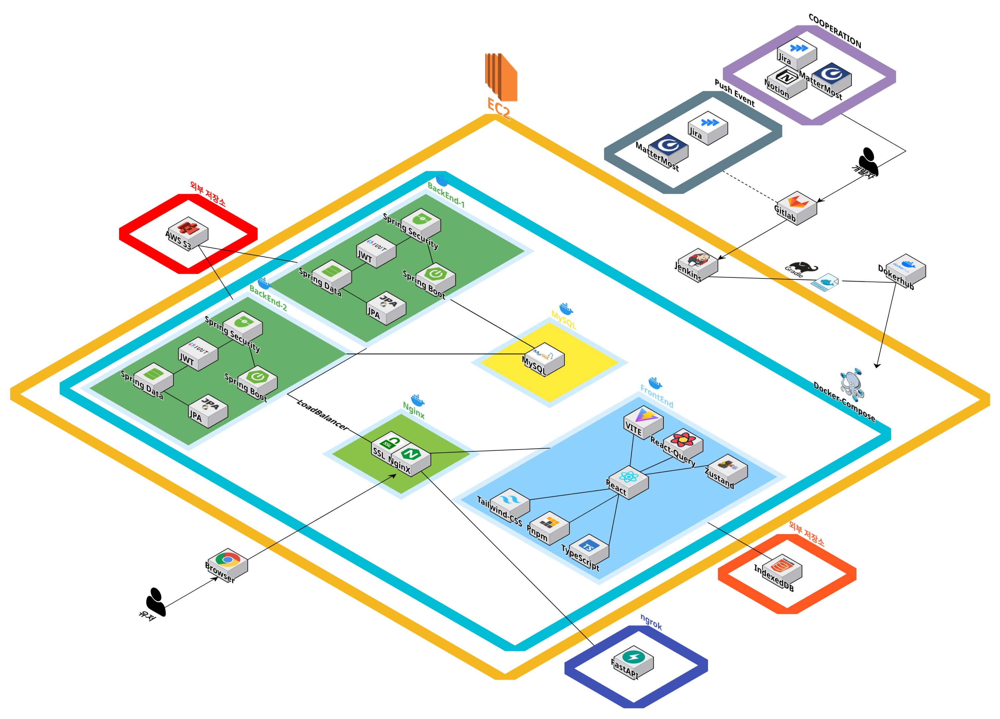
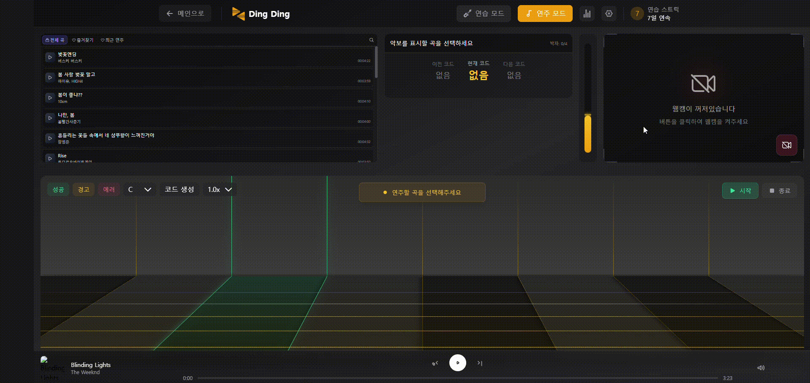
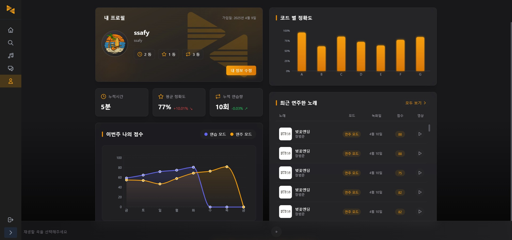
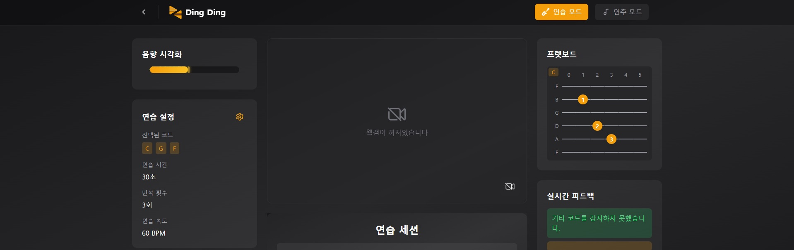
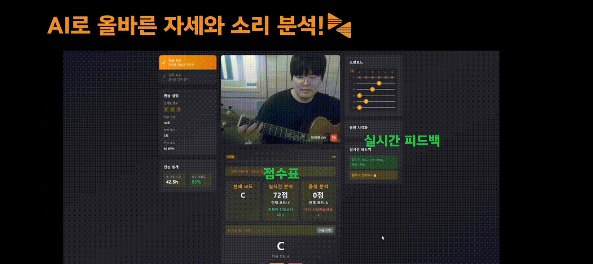
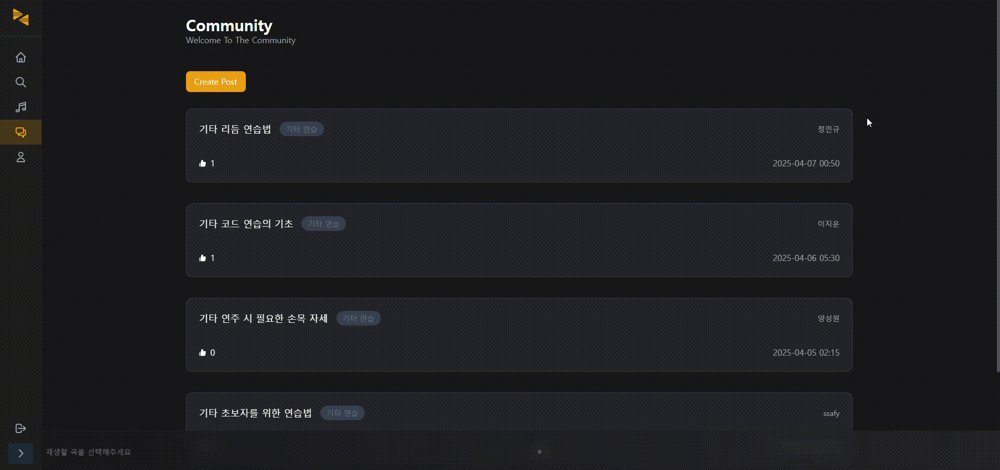
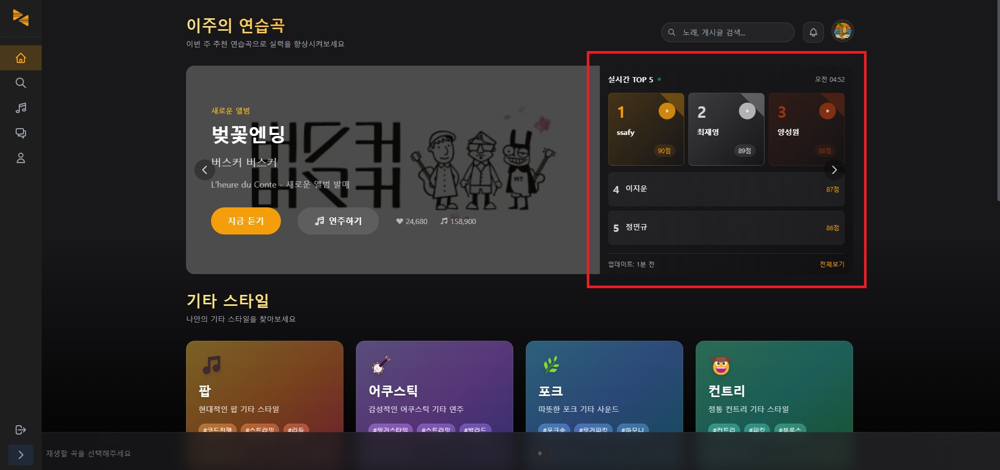
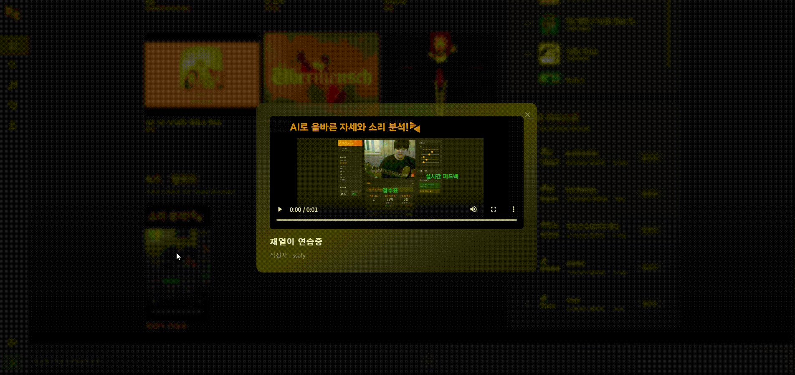
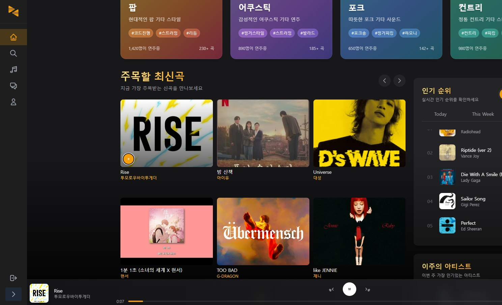
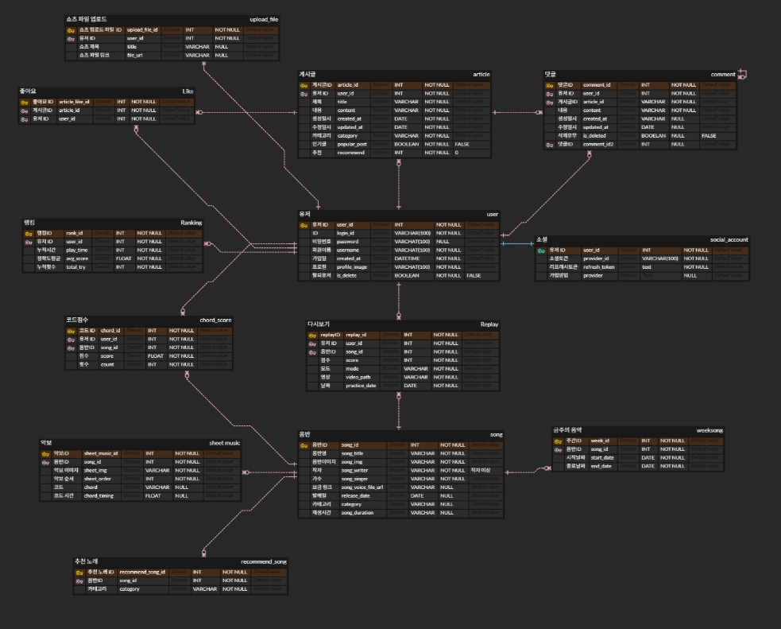

# Ding Ding ✍️🎨
- 일시 : 2025.2.24.(월)  ~ 2025.4.11.(금)
## 📝 프로젝트 개요


딩딩로고랑 
**언제 어디서나 기타를 배울 수 있는 AI 기반 학습 플랫폼 "딩딩"**
문구추가해서 걸어놓기

```
1. 기획 배경
2. 화면 소개
3. 기술 스택
4. 시스템 아키텍처
5. 프로젝트 산출물

[목차 순서 수정 or 목차에 맞게 내용 배치]
```

### **기획 배경**

노래를 들으며 한 번쯤 기타로 연주해보고 싶다는 생각, 해보신 적 있으시죠? 생각을 해본적이 있다면 그걸 실천해본적은 있나요? 
실천하지 못했다면, 우리는 왜 기타를 쉽게 배우지 못했을까요?

- 학원 등록과 이동의 번거로움
- 혼자 배우기엔 너무 높은 진입장벽
- 제대로 배우고 있는지에 대한 불확실성

이러한 문제를 해결하기 위해,  
우리는 **언제 어디서나 기타를 배울 수 있는 AI 기반 학습 플랫폼 "딩딩"**을 기획했습니다.


### **타겟**
- 기타를 배우고 싶지만, 개인 사정으로 인해 학원을 갈 수 없는 사람들
- 개인 연습을 하고 있지만 올바르게 하고 있는지 걱정이 되는 사람들

### **목적**

- **자기주도적 학습 환경 제공**  
  → 기타 학습에서 가장 중요한 **꾸준함**을 위해, 시간과 장소의 제약 없이 누구나 연습할 수 있는 AI 기반의 자기주도적 학습 환경을 제공합니다.

- **비대면 시대에 맞는 디지털 음악 교육 플랫폼 구축**  
  → 학원에 가지 않고도 **정확한 피드백**과 **체계적인 커리큘럼**을 제공하여, 비대면 음악 교육의 **새로운 표준**을 제시합니다.

- **초보자도 쉽게 접근 가능한 학습 시스템 구현**  
  → 기존 기타 학습은 진입장벽이 높았습니다. '딩딩'은 **연주 분석**, **자세 교정**, **AI 반주**, **음성 명령** 등 **초보자 친화적 기능**을 통해 접근성을 높입니다.

- **취미 이상의 가치를 제공하는 플랫폼**  
  → 단순한 연습 도구를 넘어, **커뮤니티**, **챌린지**, **쇼츠 공유** 등을 통해 사용자가 **음악적 성장을 즐기고 지속**할 수 있는 환경을 만듭니다.


### 📱서비스 설명
1. **실시간 타브 악보 & 코드 제공**: 사용자의 연주를 실시간으로 분석하여 정확한 타브 악보와 코드 진행을 자동 생성하고 화면에 시각적으로 표시
2. **연주 분석 및 점수 시스템**: 음정, 박자 분석을 통한 AI 점수화 및 피드백 제공
3. **맞춤형 연습 모드**: 원하는 코드를 추가하여 사용자가 원하는 코드를 반복 연습
4. **손가락 포지션 분석**: 웹캠 기반 AI가 손가락 움직임과 자세를 교정
5. **커뮤니티 기능**: 타 사용자와의 상호 피드백 가능
6. **랭킹 시스템**: 실시간 랭킹을 통해 동기 부여 및 주간 챌린지 참여 유도
7. **쇼츠 기능**: 본인의 연습영상을 공유하면서 상호 피드백에 도움
8. **음악 스트리밍 기능**: 다양한 장르의 음원을 제공하며, 연주에 적합한 백그라운드 음악을 실시간으로 선택 및 재생 가능


### ★핵심 기능

| MVP순으로 정리 | ai분석 |
| --- | --- |
| **연주분석** | 모션 → 음성 순서로 진행 |
| **손가락 & 자세 분석** | 카메라로 연주 자세 분석, 잘못된 자세 시 음성 피드백 |
| **리듬 & 박자 분석** | 손 움직임과 소리를 비교하여 박자 정확도 평가 |
| **AI 자동 반주 생성** | 사용자의 연주 분석 후 적절한 베이스 & 드럼 추가  |
| **난이도 조절 & 연습 모드** | 초급 ~ 고급, 특정 연주 패턴 반복 학습 가능 |
| **음성 기반 컨트롤** | 연습 모드에서 음성 명령으로 다음 단계 이동 |
| **메트로놈 & 튜닝 기능** | 메트로놈 On/Off, 기타 자동 튜닝 지원 |
| **즉흥 연주 악보화** | 내 연주를 AI가 분석해 실시간 악보로 변환 |


### 🤝 팀원

| 이름        | 담당 영역                                                  |     
| ----------- | ------------------------------------------------------------ |
| 최재영     | - Backend<br />- 프로젝트 총괄<br />- ERD 설계<br />- AI 영상 |
| 양성원     | - Backend<br />- ERD 설계<br />- API 개발 | 
| 이용재     | - Backend<br />- ERD 설계<br />- API 개발<br />- 웹소켓 구현 | 
| 이지운     | - Frontend<br />- 디자인 총괄<br />- API 연동 | 
| 임재열     | - Frontend<br />- 인프라 구축<br />- API 연동<br />- 문서정리 | 
| 정민규     | - Frontend<br />- AI 음성<br />- API 연동<br />- 디자인<br />- 문서정리 | 


## 🛠 기술스택 (Tech Stack)
- **Backend**: Spring Boot, Java 17, Fast Api, WebSocket, SptingSecurity
- **Frontend**: React, TypeScript, React Query
- **Database**: MySQL, IndexedDB, S3
- **Infra**: AWS S3, Docker, Docker-Compose, Jenkins, Nginx, Swagger, Ngrok
- **AI 모델**: YOLOv11 medium, ONNX, Template Matching, Traditional ML (RandomForest, KNN, SVM)

## 🗂️ 아키텍처 구성도



## 💡 Ding Ding 서비스 화면면

### 실시간 타브 악보 & 코드 제공


- 사용자가 곡을 선택하면 선택한 곡의 연주를 실시간으로 분석하여 정확한 타브 악보와 코드 진행을 자동 생성하고 화면에 시각적으로 표시해줍니다.


### 연주 분석 및 점수 시스템


- 음정, 박자 분석을 통한 AI 점수화 및 피드백 제공


### 맞춤형 연습 모드


- 원하는 코드를 추가하여 사용자가 원하는 코드를 반복 연습을 통하여 초보자들이 코드에 대한 연습을 충분히 할 수 있도록 도와줍니다.


### 손가락 포지션 분석


- 웹캠 기반 AI가 손가락 움직임과 자세를 교정


### 커뮤니티 기능


- 타 사용자와의 상호 피드백 가능을 제공해줍니다.


### 랭킹 시스템


- 랭킹 시스템: 실시간 랭킹을 통해 동기 부여 및 주간 챌린지 참여 유도합니다.


### 쇼츠 기능


- 본인의 연습영상을 공유하면서 상호 피드백에 도움


### 음악 스트리밍 기능


- 다양한 장르의 음원을 제공하며, 연주에 적합한 백그라운드 음악을 실시간으로 선택 및 재생 가능

##  프로젝트 산출물

### 💾 데이터베이스 모델링(ERD)




### API 명세서 


